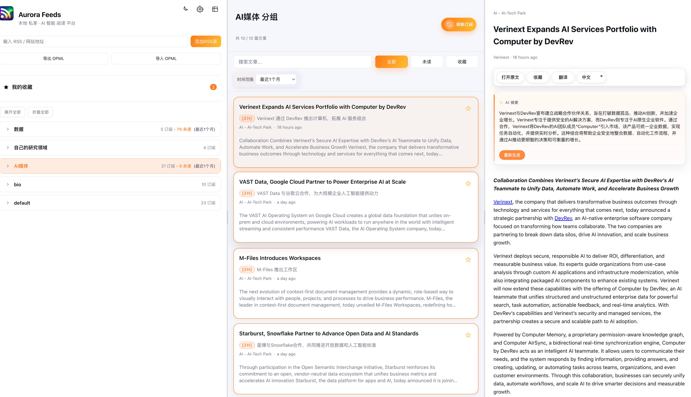

# Aurora RSS Reader


<p align="left">
  
</p>

<!-- 技术栈：Electron · Vue 3 · FastAPI · SQLite · Pinia · Vite -->

## 简介

Aurora 是一款跨平台桌面 RSS 阅读器，提供现代的三栏阅读体验、订阅分组与收藏、OPML 导入导出等基础能力；结合可配置的大语言模型，对文章进行自动化的摘要与翻译增强，同时提供多语言界面与 RSSHub 支持。

## ✨ 功能特性

- 订阅与阅读：分组管理、三栏布局、全文预览、未读/收藏筛选、快速搜索
- OPML：一键导入/导出订阅，便于迁移与备份
- 收藏与状态：收藏、标记已读，支持按分组或订阅源查看收藏
- AI 增强：由可配置的 OpenAI 兼容大语言模型自动进行 AI 增强（摘要/翻译），可手动触发或按设置自动执行；支持标题单独翻译与长文分段翻译
- 多语言界面：内置中文、英文、日语、韩语
- RSSHub：支持自定义镜像与 URL 映射，后端代为请求以规避 CORS
- 刷新与过滤：定时刷新；按发布时间/入库时间与范围过滤时间线
- 体验优化：深/浅色主题、可拖拽布局比例、错误与进度提示，本地数据库缓存便于离线阅读

## 📸 截图

<div align="center">
  <figure style="display:inline-block;margin:0 16px 18px;text-align:center;">
    
    <figcaption>桌面端三栏布局</figcaption>
  </figure>
  <figure style="display:inline-block;margin:0 16px 18px;text-align:center;">
    
    <figcaption>设置（AI · 刷新 · RSSHub）</figcaption>
  </figure>
</div>

<div align="center">
  <figure style="display:inline-block;margin:0 16px 18px;text-align:center;">
    
    <figcaption>自动翻译 + 自动摘要</figcaption>
  </figure>
  <figure style="display:inline-block;margin:0 16px 18px;text-align:center;">
    
    <figcaption>RSSHub 镜像与测试</figcaption>
  </figure>
</div>

<div align="center">
  <figure style="display:inline-block;margin:0 12px 16px;text-align:center;">
    
    <figcaption>订阅分组 / 标签</figcaption>
  </figure>
  <figure style="display:inline-block;margin:0 12px 16px;text-align:center;">
    
    <figcaption>时间过滤与自动刷新</figcaption>
  </figure>
  <figure style="display:inline-block;margin:0 12px 16px;text-align:center;">
    
    <figcaption>界面：中文</figcaption>
  </figure>
</div>

<div align="center">
  <figure style="display:inline-block;margin:0 10px 14px;text-align:center;">
    
    <figcaption>界面：英文</figcaption>
  </figure>
  <figure style="display:inline-block;margin:0 10px 14px;text-align:center;">
    
    <figcaption>界面：日语</figcaption>
  </figure>
  <figure style="display:inline-block;margin:0 10px 14px;text-align:center;">
    
    <figcaption>界面：韩语</figcaption>
  </figure>
</div>

## 🧱 架构概览

- 桌面壳：Electron 主进程启动并托管后端服务（`rss-desktop/electron/main.ts`）
- 前端：Vue 3 + Vite + Pinia + vue-router + vue-i18n（`rss-desktop/src`）
- 后端：FastAPI + SQLModel + httpx + APScheduler（`backend/app`）
- 数据库存储：SQLite（默认 `backend/data/rss.sqlite`）
- 刷新任务：APScheduler 周期拉取订阅（默认 `fetch_interval_minutes`）
- AI 能力：通过 OpenAI 兼容模型执行摘要与翻译（支持长文分段并发翻译与本地缓存）

## 🚀 快速开始

### 环境要求

当前开发环境实测版本（用于参考）：

| 组件    | 实测版本 |
| ------- | -------- |
| Node.js | 22.21.1  |
| pnpm    | 10.21.0  |
| Python  | 3.12.12  |

> 提示：如使用其他版本，请确保能通过 `./start.sh` 与 `curl http://127.0.0.1:15432/health` 这两个最小自检。

### 🚀 一键启动开发（推荐）

使用项目根目录的 `start.sh` 脚本，一键完成环境准备与启动：

```bash
chmod +x start.sh
./start.sh
```

**脚本执行步骤：**
1. 自动检查并创建后端 Python 虚拟环境（`backend/.venv`）
2. 自动安装后端依赖（requirements.txt）
3. 自动安装前端依赖（pnpm install）
4. 自动初始化数据库（SQLite）
5. 启动开发环境（Electron + 后端服务）

**访问地址：**
- 前端界面：`http://localhost:5173` （Electron 应用）
- 后端 API：`http://127.0.0.1:15432`
- 健康检查：`curl http://127.0.0.1:15432/health`

### 🔧 手动安装与开发

如果需要手动设置环境：

1) **后端环境设置**

```bash
cd backend
python -m venv .venv
source .venv/bin/activate  # Windows: .venv\Scripts\activate
pip install -r requirements.txt
cp .env.example .env
python -m scripts.migrate
```

2) **配置后端 `.env`**

```env
APP_ENV=development
API_HOST=127.0.0.1
API_PORT=15432
FETCH_INTERVAL_MINUTES=15

RSSHUB_BASE=https://rsshub.app

GLM_BASE_URL=https://open.bigmodel.cn/api/paas/v4/  # 示例 API
GLM_MODEL=glm-4-flash                          # 示例模型
GLM_API_KEY=                                   # OpenAI 兼容 API 密钥
```

3) **前端开发**

```bash
cd rss-desktop
pnpm install
pnpm dev  # 启动开发服务器
```

### 📦 构建发布版本

使用优化的构建脚本生成可分发的桌面应用：

```bash
chmod +x build-release-app.sh
./build-release-app.sh
```

**构建流程：**
1. 自动清理旧的构建文件
2. 使用 PyInstaller 打包后端二进制文件
3. 使用 Vite 构建前端资源
4. 使用 electron-builder 生成交装包

**输出文件位置：**
- `rss-desktop/release/1.0.0/Aurora RSS Reader-Mac-1.0.0-x64.dmg`（Intel Mac）
- `rss-desktop/release/1.0.0/Aurora RSS Reader-Mac-1.0.0-arm64.dmg`（Apple Silicon）


## ⚙️ 配置与特性

- AI 配置：在设置中填写 OpenAI 兼容 API 的 Base URL、Model 与 API Key；可独立开启「自动摘要」「自动翻译」「标题自动翻译」，并选择翻译目标语言
- RSSHub：在设置中配置镜像地址并测试连通性，可通过后端 API `/api/settings/rsshub-url` 同步更新
- 时间过滤：支持按 `published_at` 或 `inserted_at` 且提供 1d/7d/30d/90d/180d/365d/all 预设范围
- OPML：从左侧工具区导入或导出 `.opml/.xml`
- 布局：拖拽分隔条调整侧栏/详情比例，内置深/浅色主题记忆

## 🔌 API（选读）

- 订阅：`GET/POST/PATCH/DELETE /api/feeds`，`POST /api/feeds/{id}/refresh`
- 文章：`GET /api/entries`，`PATCH /api/entries/{id}`；收藏相关接口见 `backend/app/api/routes/entries.py`
- OPML：`GET /api/opml/export`，`POST /api/opml/import`
- AI：`POST /api/ai/summary`，`POST /api/ai/translate`，`POST /api/ai/translate-title`
- 设置：`GET/PATCH /api/settings`，AI 配置见 `backend/app/api/routes/ai.py`

## 🔒 安全与隐私

- 本地 `.env` 保存 API Key，不会提交到仓库（已在 `.gitignore`）
- 数据库存放于本地 `backend/data/`，摘要与翻译结果会缓存以减少开销
- 可使用 `./tools/scan-secrets.sh` 扫描潜在敏感信息后再提交

## 🛡️ 知识产权与溯源

- `build_signature.json`：记录作者 `xiongxiangyi <1666526339@qq.com>`、生成时间、commit 与 SHA-256 指纹，请在重新发布或自动化构建时同步更新。
- 关键视觉素材（如 `images/banner_sharp_aurora.png`）内嵌 `Aurora-Author` / `Aurora-Provenance` PNG 文本块作为数字水印，用于证明原创性，请勿移除。

## 🗂️ 项目结构

```
RSSpage/
├─ 📄 README.md                      # 项目文档
├─ 📄 RSSHUB_CONFIG_GUIDE.md         # RSSHub 配置指南
├─ 📄 RSSHUB_TROUBLESHOOTING.md      # 故障排除指南
├─ 🔧 start.sh                       # 开发启动脚本
├─ 🔧 build-release-app.sh           # 发布构建脚本
├─ 📁 backend/                        # 后端服务
│  ├─ 📁 app/                         # 应用核心
│  │  ├─ 📁 api/routes/              # FastAPI 路由
│  │  ├─ 📁 core/                    # 配置管理
│  │  ├─ 📁 db/                      # SQLModel 数据模型
│  │  ├─ 📁 services/                # 业务服务
│  │  └─ 📁 schemas/                 # Pydantic 模型
│  ├─ 📁 scripts/                     # 工具脚本
│  ├─ 📁 .venv/                       # Python 虚拟环境
│  ├─ 📄 backend.spec                  # PyInstaller 配置
│  └─ 📄 requirements.txt              # Python 依赖
└─ 📁 rss-desktop/                   # 前端应用
   ├─ 📁 src/                         # Vue 3 源码
   ├─ 📁 electron/                    # Electron 主进程
   ├─ 📁 node_modules/                 # 前端依赖
   └─ 📁 release/                      # 构建输出
```

## 🛠️ 项目脚本说明

项目提供了简洁的脚本系统：

### 🚀 开发相关
- **`start.sh`** - 一键启动开发环境
  - 自动检查和创建 Python 虚拟环境
  - 安装前后端依赖
  - 初始化数据库
  - 启动 Electron 开发服务器

### 📦 构建相关
- **`build-release-app.sh`** - 构建发布版本
  - 清理旧构建文件
  - 打包后端二进制文件
  - 构建前端资源
  - 生成跨平台安装包

## 📚 相关文档

- **RSSHUB_CONFIG_GUIDE.md** - RSSHub 配置指南
- **RSSHUB_TROUBLESHOOTING.md** - 故障排除指南

## 🙏 致谢

- FastAPI、Vue 3、Electron、SQLModel、httpx、APScheduler
- OpenAI 兼容模型服务（例如 GLM-4 系列 / open.bigmodel.cn）

如需英文版 README 或将截图改为更轻量的拼图布局，请告诉我。
