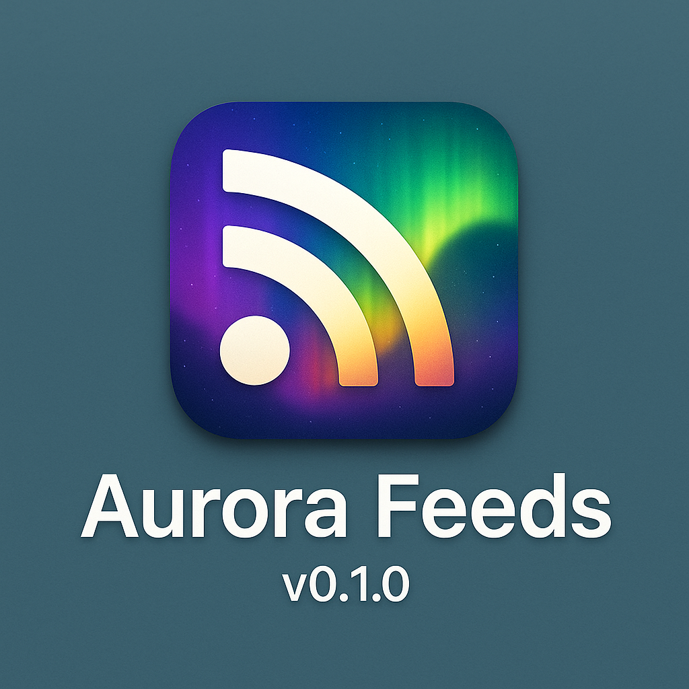
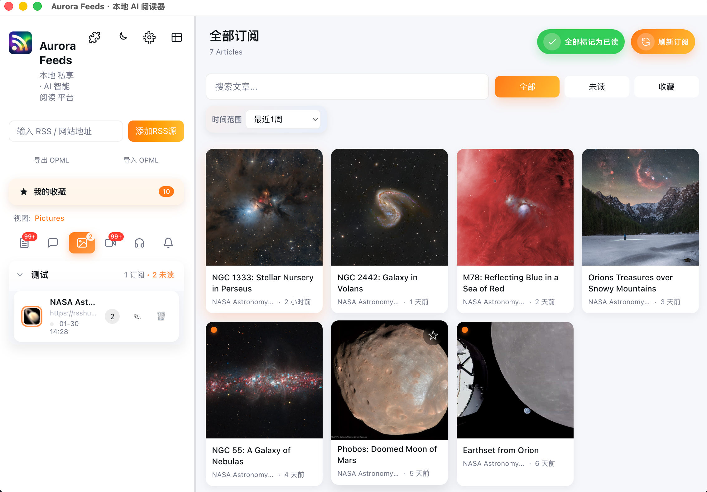
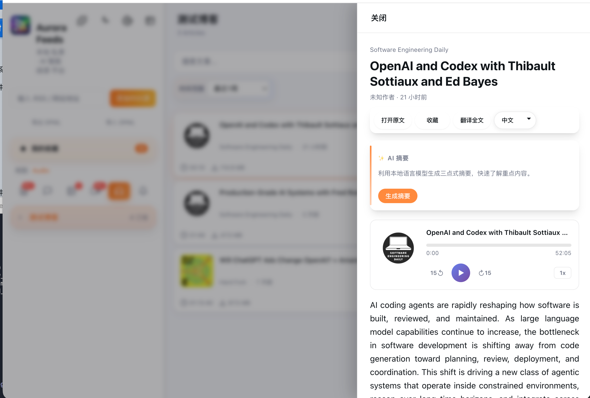
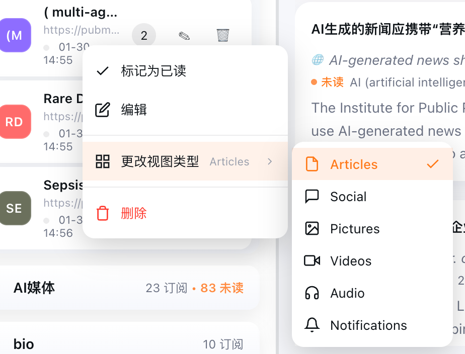
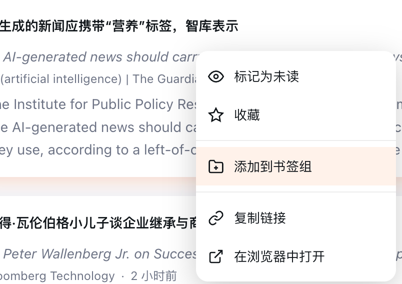
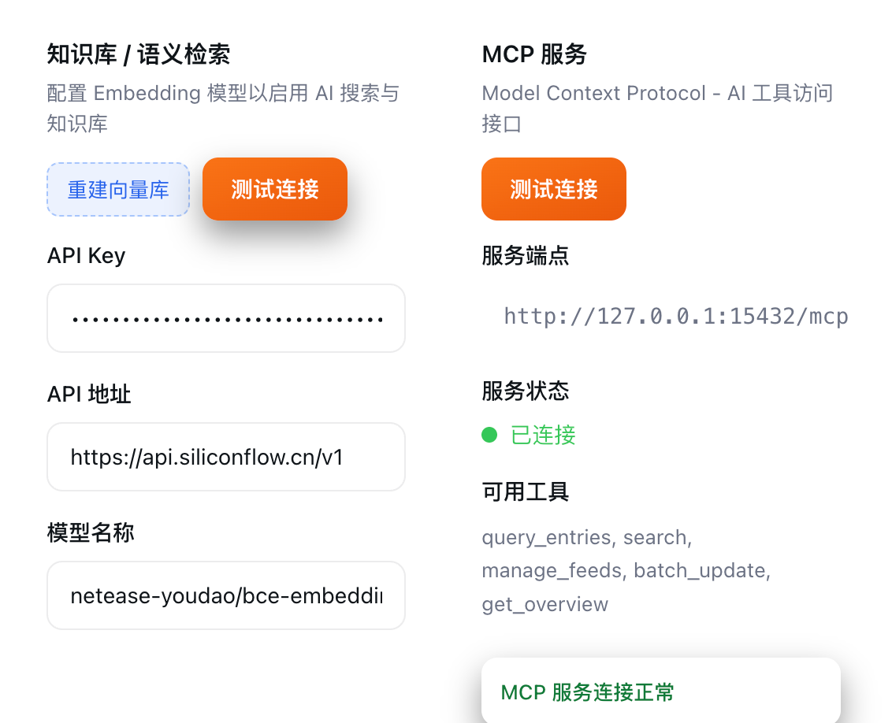
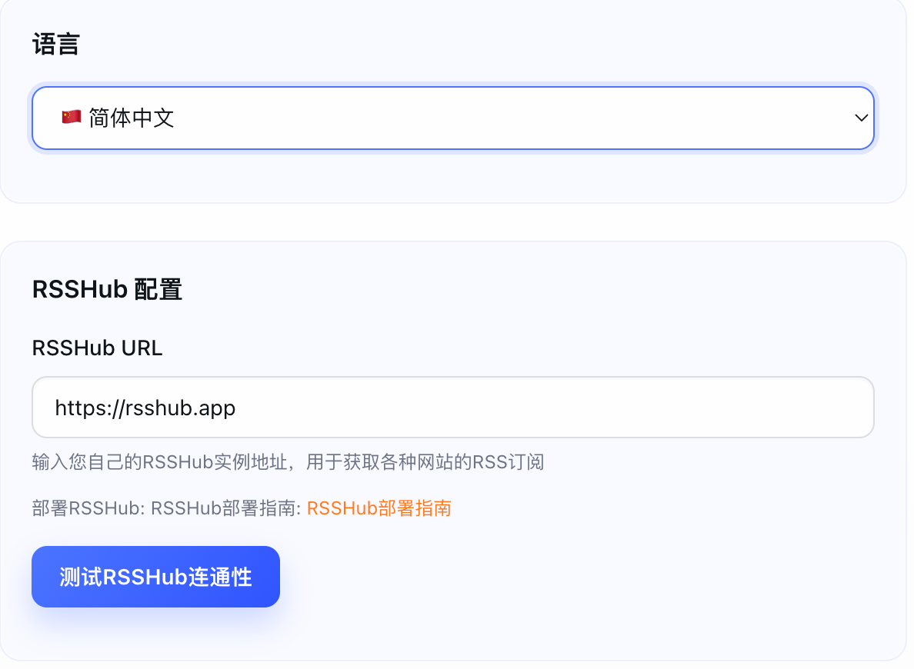
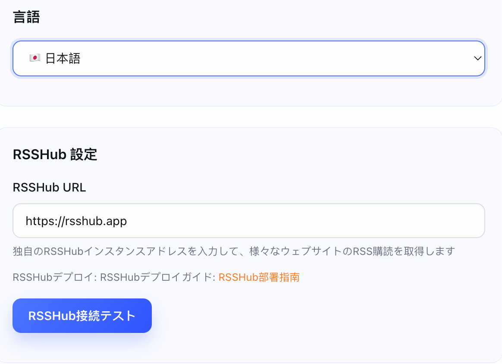
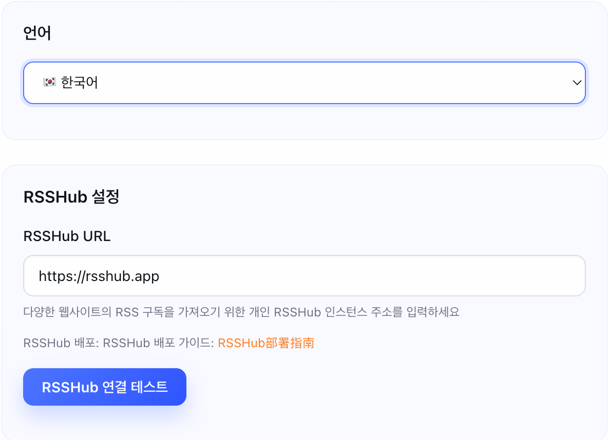

# Aurora RSS Reader


<p align="center">
  <a href="https://github.com/xiongsircool/aurora-rss-reader">
    
  </a>
  <a href="https://github.com/xiongsircool/aurora-rss-reader">
    
  </a>
  <a href="https://github.com/xiongsircool/aurora-rss-reader/issues">
    
  </a>
  <a href="https://github.com/xiongsircool/aurora-rss-reader/blob/main/LICENSE">
    
  </a>
</p>

<p align="center">
  <a href="README_ZH.md">🇨🇳 中文</a> • <a href="README.md">🇺🇸 English</a>
</p>

<div align="center">
  
</div>

## 🎉 v0.1.6 Latest Release | 最新版本

**Major UI Enhancement & New Features | 重大UI升级与新功能**

- 🎬 **Media Feed Support** - Enhanced display for video and image feeds with optimized layouts
- 🎧 **Podcast Support** - Audio player with enclosure support for podcast feeds
- 📚 **Zotero Integration** - Send academic articles to Zotero with DOI/PMID auto-detection
- 📁 **Collections Feature** - Organize articles into custom bookmark collections
- 🖱️ **Enhanced Context Menu** - Rich right-click menu for feeds and entries
- 🔬 **MCP Status Display** - Visual indicator for Model Context Protocol server status
- 🎨 **View Type Classification** - Auto-detect and optimize display for blogs, videos, images, podcasts

---

## Introduction

Aurora RSS Reader is a cross-platform desktop RSS reader integrated with AI translation and summarization features. It supports multiple layout modes, local data storage, and rich customization options.

**Current Version: v0.1.6**

## Key Features

### Reading Experience
- **Multiple Layout Modes** - Support for three-column and single-column layouts
- **Group Management** - Organize RSS feeds by categories
- **Full-text Search** - Quick search in titles and content
- **Favorites Feature** - Bookmark important articles for later reading
- **Time Filtering** - Filter articles by publication date

### Smart Features
- **Article Summaries** - Automatically generate key points for quick understanding
- **Multi-language Translation** - Support full-text and title translation for barrier-free reading
- **Multi-language Interface** - Chinese, English, Japanese, Korean interface support
- **Flexible Configuration** - Support multiple translation and summarization services

### System Features
- **Local Storage** - SQLite database, offline available
- **OPML Import/Export** - Easy data migration
- **Auto Refresh** - Periodically fetch latest articles
- **Dark Mode** - Support dark and light themes
- **RSSHub Support** - Extend RSS feed coverage

## Interface Preview

### Media Feed Support
<div align="center">
  <figure style="display:inline-block;margin:0 12px 18px;text-align:center;vertical-align:bottom;">
    
    <figcaption>Video Feed Display</figcaption>
  </figure>
  <figure style="display:inline-block;margin:0 12px 18px;text-align:center;vertical-align:bottom;">
    
    <figcaption>Image Feed Display</figcaption>
  </figure>
</div>

### Blog & Article Enhancement
<div align="center">
  
</div>

### Context Menu & Collections
<div align="center">
  <figure style="display:inline-block;margin:0 12px 18px;text-align:center;">
    
    <figcaption>Feed Context Menu</figcaption>
  </figure>
  <figure style="display:inline-block;margin:0 12px 18px;text-align:center;">
    
    <figcaption>Add to Collection</figcaption>
  </figure>
</div>

### MCP Status Display
<div align="center">
  
</div>

### Multi-language Interface
<div align="center">
  <figure style="display:inline-block;margin:0 12px 16px;text-align:center;">
    
    <figcaption>Chinese</figcaption>
  </figure>
  <figure style="display:inline-block;margin:0 12px 16px;text-align:center;">
    
    <figcaption>English</figcaption>
  </figure>
  <figure style="display:inline-block;margin:0 12px 16px;text-align:center;">
    
    <figcaption>Japanese</figcaption>
  </figure>
  <figure style="display:inline-block;margin:0 12px 16px;text-align:center;">
    
    <figcaption>Korean</figcaption>
  </figure>
</div>

## Quick Start

### System Requirements
- Node.js 18+
- pnpm 8+

### Installation and Running
```bash
# Clone the repository
git clone https://github.com/xiongsircool/aurora-rss-reader.git
cd aurora-rss-reader

# Recommended: Node.js backend
cd backend-node
npm install
cd ../rss-desktop
pnpm install
pnpm dev

# Quick start (Node.js backend)
cd ..
chmod +x start.sh
./start.sh
```

### Development Setup (Manual)
Recommended (backend-node):
- `cd backend-node && npm install`
- `cd rss-desktop && pnpm install`
- `pnpm dev` (from `rss-desktop`)

### Troubleshooting
### macOS Compatibility
**Initial Setup:**
1. **Download the `.zip` version** if the `.dmg` fails to mount (common on some systems for unsigned apps).
2. Unzip and drag `Aurora RSS Reader.app` to your Applications folder.
3. If you see **"App is damaged and can't be opened"** (or "cannot open"):
   - This is normal for unsigned open-source apps on macOS.
   - Open Terminal and run:
     ```bash
     sudo xattr -rd com.apple.quarantine /Applications/AuroraRSSReader.app
     ```
   - Then open the app again.

### Performance
**Q: The app is slow to start?**
A: Check the backend service logs if possible. First launch may take longer to initialize the database.
- Initialize database
- Launch Electron application

### Access URLs
- **Desktop App**: Electron window opens automatically
- **Web Interface**: http://localhost:5173
- **API Service**: http://127.0.0.1:15432

### Configuration
Set environment variables for the Node.js backend to configure AI and RSSHub:

```env
# RSSHub
RSSHUB_BASE_URL=https://rsshub.app

# AI Configuration
GLM_BASE_URL=https://open.bigmodel.cn/api/paas/v4/
GLM_MODEL=glm-4-flash
GLM_API_KEY=your_api_key_here
```

## 🐳 Docker Deployment

```bash
# Quick start with Docker Compose
git clone https://github.com/xiongsircool/aurora-rss-reader.git
cd aurora-rss-reader
docker-compose up -d

# Access: http://localhost:8080
```

For detailed Docker configuration, see [Docker README](docker/README.md).

> **Note**: Docker image only supports `linux/amd64` architecture.

## Build and Release

```bash
# Build installation package
chmod +x build-release-app.sh
./build-release-app.sh
```

Generated files:
- macOS: `AuroraRSSReader-Mac-0.1.6-{x64,arm64}.dmg`
- Windows: `AuroraRSSReader-Windows-0.1.6-x64-Setup.exe`
- Linux: `AuroraRSSReader-Linux-0.1.6-x64.AppImage`

## 📋 Documentation | 文档

- **[Update Details](UPDATE_README.md)** - Detailed update content | 详细更新内容
- **[Chinese Version](README_ZH.md)** - Complete documentation in Chinese | 中文完整文档

## Tech Stack

- **Frontend**: Vue 3 + Vite + Pinia + TypeScript
- **Backend**: Fastify + TypeScript + SQLite
- **Desktop App**: Electron
- **Build Tools**: electron-builder

## Project Structure

```
aurora-rss-reader/
├── rss-desktop/          # Frontend code
│   ├── src/             # Vue source code
│   └── electron/        # Electron main process
├── backend-node/        # Node.js backend (Fastify)
├── images/              # Image resources
└── start.sh            # Startup script
```

## Support

- **Issue Reporting**: [GitHub Issues](https://github.com/xiongsircool/aurora-rss-reader/issues)
- **Feature Suggestions**: [GitHub Discussions](https://github.com/xiongsircool/aurora-rss-reader/discussions)
- **Email Contact**: 1666526339@qq.com

## License

This project uses [GNU General Public License v3.0](LICENSE), which is a copyleft open source license requiring derivative works to also be open source.

---

## 🎯 Future Roadmap

### Short-term Plans (v0.2)
- [ ] **Mobile Support** - Develop iOS and Android mobile applications
- [ ] **AI Daily Briefing** - Smart daily news summaries and personalized recommendations
- [x] **Podcast Support** - Support for audio podcast subscription and playback ✅
- [ ] **Reading Analytics** - Personal reading habits analysis and data visualization

### Mid-term Plans (v0.3)
- [ ] **Data Synchronization** - Cross-device data sync and cloud backup
- [ ] **Plugin System** - Support for third-party plugin extensions

---

Give it a ⭐ if you find it useful!
