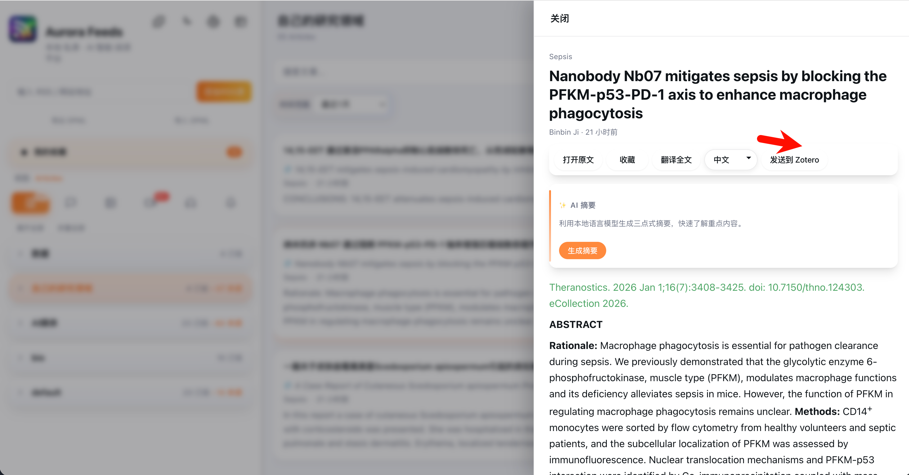

# Aurora RSS Reader


<p align="center">
  <a href="https://github.com/xiongsircool/aurora-rss-reader">
    
  </a>
  <a href="https://github.com/xiongsircool/aurora-rss-reader">
    
  </a>
  <a href="https://github.com/xiongsircool/aurora-rss-reader/issues">
    
  </a>
  <a href="https://github.com/xiongsircool/aurora-rss-reader/blob/main/LICENSE">
    
  </a>
</p>

<div align="center">
  
</div>

## 📋 更新公告 | Update News

### 🎉 v0.1.6 最新版本 | Latest Version

**重大UI升级与新功能 | Major UI Enhancement & New Features**

- 🎬 **媒体订阅支持** - 视频和图片订阅源优化显示布局
- 🎧 **播客支持** - 音频播放器支持播客订阅
- 📚 **Zotero 集成** - 学术文献一键发送到 Zotero，自动识别 DOI/PMID
- 📁 **收藏夹功能** - 将文章整理到自定义书签组
- 🖱️ **右键菜单增强** - 订阅源和文章的丰富右键操作
- 🔬 **MCP 状态显示** - Model Context Protocol 服务器状态可视化
- 🎨 **视图类型分类** - 自动识别博客、视频、图片、播客并优化显示

---

Aurora RSS Reader is a modern cross-platform desktop RSS reader integrated with AI translation and summarization features. Built with Electron + Vue 3 + Fastify (Node.js) stack, providing smooth user experience and powerful functionality.

**Current Version: v0.1.6**

## 🇨🇳 中文 | 🇺🇸 English

<details>
<summary><strong>📖 查看英文介绍 | View English Introduction</strong></summary>

## Introduction

Aurora RSS Reader is a cross-platform desktop RSS reader integrated with AI translation and summarization features. It supports multiple layout modes, local data storage, and rich customization options.

**Current Version: v0.1.6**

### Features | 功能特色

#### 🎨 Reading Experience | 阅读体验
- **Multi-layout Support | 多种布局模式** - Three-column and single-column layouts
- **Group Management | 分组管理** - Organize RSS sources by categories
- **Full-text Search | 全文搜索** - Quick search in titles and content
- **Favorites Feature | 收藏功能** - Bookmark important articles for later reading
- **Time Filtering | 时间过滤** - Filter articles by publish time

#### 🤖 Smart Features | 智能功能
- **Article Summarization | 文章摘要** - Automatically generate article summaries
- **Multi-language Translation | 多语言翻译** - Translate full text and titles
- **Multi-language Interface | 多语言界面** - Chinese, English, Japanese, Korean support

#### 🔧 System Features | 系统功能
- **Local Storage | 本地存储** - SQLite database, offline available
- **OPML Import/Export | OPML 导入导出** - Easy data migration
- **Auto Refresh | 自动刷新** - Regularly fetch latest articles
- **Dark Mode | 深色模式** - Support for light and dark themes
- **Cross-platform Support | 跨平台支持** - Windows, macOS, Linux

### Quick Start | 快速开始

```bash
# Clone repository | 克隆仓库
git clone https://github.com/xiongsircool/aurora-rss-reader.git
cd aurora-rss-reader

# Start with one click | 一键启动
chmod +x start.sh
./start.sh
```

### Tech Stack | 技术栈

- **Frontend | 前端**: Vue 3 + Vite + Pinia + TypeScript
- **Backend | 后端**: Fastify + TypeScript + SQLite
- **Desktop | 桌面**: Electron
- **Build | 构建**: electron-builder

</details>

---

## 功能特色

### 阅读体验
- **多种布局模式** - 支持三栏式和一栏式布局
- **分组管理** - 将 RSS 源按分类整理
- **全文搜索** - 在标题和内容中快速查找
- **收藏功能** - 收藏重要文章便于后续阅读
- **时间过滤** - 按发布时间筛选文章

### 智能功能
- **文章摘要** - 自动生成文章要点，快速了解内容
- **多语言翻译** - 支持全文和标题翻译，阅读无障碍
- **多语言界面** - 中文、英文、日语、韩语界面支持
- **灵活配置** - 支持多种翻译和摘要服务

### 系统功能
- **本地存储** - SQLite 数据库，离线可用
- **OPML 导入导出** - 方便数据迁移
- **自动刷新** - 定时获取最新文章
- **深色模式** - 支持深色和浅色主题
- **RSSHub 支持** - 扩展 RSS 源覆盖范围
- **窗口管理** - 优化的 macOS 窗口生命周期管理
- **多平台支持** - Windows、macOS、Linux 全平台兼容

### 界面预览

#### 🎬 媒体订阅支持
<div align="center">
  <figure style="display:inline-block;margin:0 12px 18px;text-align:center;vertical-align:bottom;">
    
    <figcaption>视频订阅显示</figcaption>
  </figure>
  <figure style="display:inline-block;margin:0 12px 18px;text-align:center;vertical-align:bottom;">
    
    <figcaption>图片订阅显示</figcaption>
  </figure>
</div>

#### 📝 博客订阅增强
<div align="center">
  
</div>

#### 🖱️ 右键菜单与收藏夹
<div align="center">
  <figure style="display:inline-block;margin:0 12px 18px;text-align:center;">
    
    <figcaption>订阅源右键菜单</figcaption>
  </figure>
  <figure style="display:inline-block;margin:0 12px 18px;text-align:center;">
    
    <figcaption>添加到收藏夹</figcaption>
  </figure>
</div>

#### 🔬 MCP 状态显示
<div align="center">
  
</div>

#### 📚 Zotero 集成
<div align="center">
  
</div>

#### 🔍 工作区高级检索
<div align="center">
  
</div>

## 快速开始

### 系统要求
- Node.js 18+
- pnpm 8+

### 安装运行
```bash
# 克隆仓库
git clone https://github.com/xiongsircool/aurora-rss-reader.git
cd aurora-rss-reader

# 推荐：Node.js 后端
cd backend-node
npm install
cd ../rss-desktop
pnpm install
pnpm dev

# 快速启动（Node.js 后端）
cd ..
chmod +x start.sh
./start.sh
```

`start.sh` 会安装依赖并启动 Electron。

### 访问地址
- **桌面应用**：自动打开 Electron 窗口
- **Web 界面**：http://localhost:5173
- **API 服务**：http://127.0.0.1:15432

### 配置
通过环境变量配置 AI 和 RSSHub：

```env
# RSSHub
RSSHUB_BASE_URL=https://rsshub.app

# AI 配置
GLM_BASE_URL=https://open.bigmodel.cn/api/paas/v4/
GLM_MODEL=glm-4-flash
GLM_API_KEY=your_api_key_here
```

### 数据存储目录
- **macOS**：`~/Library/Application Support/Aurora RSS Reader/aurora-rss.db`
- **Windows**：`%APPDATA%/Aurora RSS Reader/aurora-rss.db`
- **Linux**：`~/.config/aurora-rss-reader/aurora-rss.db`
- 可通过设置环境变量 `DATABASE_PATH` 指定数据库路径。

## 🐳 Docker 部署

```bash
# 使用 Docker Compose 快速启动
git clone https://github.com/xiongsircool/aurora-rss-reader.git
cd aurora-rss-reader
docker-compose up -d

# 访问: http://localhost:8080
```

详细配置请参考 [Docker 部署文档](docker/README.md)。

> **注意**: Docker 镜像仅支持 `linux/amd64` 架构。

## 构建发布

```bash
# 构建安装包
chmod +x build-release-app.sh
./build-release-app.sh
```

生成的文件：
- macOS: `AuroraRSSReader-Mac-0.1.6-{x64,arm64}.dmg`
- Windows: `AuroraRSSReader-Windows-0.1.6-x64-Setup.exe`
- Linux: `AuroraRSSReader-Linux-0.1.6-x64.AppImage`

## 技术栈

- **前端**：Vue 3 + Vite + Pinia + TypeScript
- **后端**：Fastify + TypeScript + SQLite
- **桌面应用**：Electron
- **构建工具**：electron-builder

## 项目结构

```
aurora-rss-reader/
├── rss-desktop/          # 前端代码
│   ├── src/             # Vue 源码
│   └── electron/        # Electron 主进程
├── backend-node/        # Node.js 后端（Fastify）
├── images/              # 图片资源
└── start.sh            # 启动脚本
```

## 📋 更新日志 | Changelog

### v0.1.6 (当前版本 | Current Version) 🎉
**重大UI升级与新功能 | Major UI Enhancement & New Features**

#### ✨ 新增功能 | New Features
- **媒体订阅支持** - 视频和图片订阅源优化显示布局
- **播客支持** - 音频播放器支持播客订阅和播放
- **Zotero 集成** - 学术文献一键发送到 Zotero，自动识别 DOI/PMID
- **收藏夹功能** - 将文章整理到自定义书签组
- **右键菜单增强** - 订阅源和文章的丰富右键操作
- **MCP 状态显示** - Model Context Protocol 服务器状态可视化
- **视图类型分类** - 自动识别博客、视频、图片、播客并优化显示

### v0.1.5 (历史版本 | Previous Version)
**功能增强与稳定性改进 | Feature Enhancement & Stability Improvements**

#### ✨ 新增功能 | New Features
- **应用内自动更新** - 集成 electron-updater 实现版本检测和自动安装
- **MCP 服务器支持** - 新增 Model Context Protocol 服务器，增强 AI 集成
- **向量搜索** - 使用 sqlite-vss 实现语义搜索功能
- **批量翻译 API** - 支持批量翻译文章，提升效率

#### 🎨 UI/UX 优化 | UI/UX Improvements
- **翻译流程优化** - 改进翻译交互体验
- **详情面板增强** - 优化文章详情展示
- **收藏和未读标识** - 精简视觉设计

#### 🔧 技术优化 | Technical Improvements
- **CI/CD 流水线** - GitHub Actions 多平台自动构建和发布
- **macOS 双架构** - 支持 Intel (x64) 和 Apple Silicon (arm64)
- **DMG 修复** - 解决 macOS DMG 挂载问题
- **原生模块编译** - 升级 better-sqlite3 并修复 Electron 编译问题

### v0.1.3 (历史版本 | Previous Version)
**重要Bug修复版本 | Critical Bug Fix Release**

#### 🐛 Bug修复 | Bug Fixes
- **时间过滤核心问题** - 修复"最近一天"等时间过滤完全失效的关键问题
- **分类显示Bug** - 修复点击分类后订阅列表不可见的问题
- **时区计算错误** - 解决RSS时间解析8小时偏差问题
- **依赖管理** - 修复缺失python-dateutil依赖导致的部署问题

#### ⚡ 功能增强 | Feature Enhancements
- **RSS解析引擎** - 集成dateutil库，解析成功率从~60%提升到83.3%+
- **学术期刊支持** - 支持Nature、ScienceDirect等期刊格式
- **RSSHub镜像** - 支持自定义镜像服务，提高网络访问稳定性
- **智能时间处理** - 未来时间使用导入时间，避免条目丢失

#### 🔧 技术优化 | Technical Improvements
- 新增`python-dateutil>=2.8.0`依赖
- 数据库清理和优化，清理1,793个历史条目
- 完善Git忽略规则，避免提交临时文件

### v0.1.0 (历史版本 | Previous Version)
#### 新增功能
- ✨ 多布局模式支持（三栏式、一栏式）
- ✨ AI 翻译和摘要功能集成
- ✨ 多语言界面支持（中文、英文、日语、韩语）
- ✨ RSS 订阅分组管理
- ✨ 文章收藏和时间过滤
- ✨ 全文搜索功能
- ✨ OPML 导入导出

#### 优化改进
- 🐛 修复 macOS 窗口生命周期管理问题
- 🎨 优化界面布局和用户体验
- 🔄 改进时区处理，统一时间显示
- ⚡ 增强应用启动和窗口恢复性能

## 📚 文档 | Documentation

- **[更新说明](UPDATE_README.md)** - 详细更新内容
- **完整项目文档** - 旧版本文档已归档至 `docs_archive/` 目录

## ❓ 常见问题

### macOS 相关
**Q: macOS 上关闭窗口后，为什么从 dock 栏点击会报错？**
A: 这个问题已在 v0.1.0 版本中修复。如果仍有问题，请确保使用最新版本。

**Q: 如何在 macOS 上完全退出应用？**
A: 使用 `Cmd + Q` 快捷键或右键点击 dock 图标选择退出。

### 配置相关
**Q: 如何配置 AI 服务？**
A: 通过环境变量设置 `GLM_API_KEY` 等配置（例如在启动前导出环境变量）。

**Q: 数据存储在哪里？**
A: 数据默认存储在系统应用数据目录：
- macOS: `~/Library/Application Support/Aurora RSS Reader/aurora-rss.db`
- Windows: `%APPDATA%/Aurora RSS Reader/aurora-rss.db`
- Linux: `~/.config/aurora-rss-reader/aurora-rss.db`

### macOS 常见问题
**安装问题：**
1. **优先下载 `.zip` 版本**：如果 `.dmg` 提示"无法打开磁盘"或"无法连接"（Unsigned App 常见问题），请使用 ZIP 版本。
2. 解压后将 `Aurora RSS Reader.app` 拖入应用程序文件夹。
3. 如果提示 **"应用已损坏"** 或 **"无法打开"**：
   - 这是因为应用没有购买苹果开发者证书（每年$99），被 Gatekeeper 拦截。
   - 解决方法：打开终端（Terminal），输入以下命令并回车（需要输入密码）：
     ```bash
     sudo xattr -rd com.apple.quarantine /Applications/AuroraRSSReader.app
     ```
   - 再次点击应用即可正常打开。

### 性能相关
**Q: 应用启动慢怎么办？**
A: 检查后端服务是否正常启动，可以查看终端输出的启动日志。

## 支持

- **问题反馈**：[GitHub Issues](https://github.com/xiongsircool/aurora-rss-reader/issues)
- **功能建议**：[GitHub Discussions](https://github.com/xiongsircool/aurora-rss-reader/discussions)
- **邮件联系**：1666526339@qq.com

## 许可证

本项目使用 [GNU General Public License v3.0](LICENSE)，这是一个 copyleft 开源许可证，要求衍生作品也必须开源。

---

## 🎯 未来规划

### 近期计划 (v0.2)
- [ ] **AI日报功能** - 智能生成每日热点新闻摘要和个性化推荐
- [x] **播客支持** - 支持音频播客订阅和播放功能 ✅
- [ ] **阅读统计** - 个人阅读习惯分析和数据可视化
- [ ] **兼容性开发** - 兼容RssHub支持RssHUB导入订阅
- [ ] **开发浏览器插件** - AI解析网站出Rsshub的订阅规则

### 中期计划 (v0.3)
- [ ] **数据同步** - 跨设备数据同步和云备份
- [ ] **插件系统** - 支持第三方插件扩展功能

---

觉得有用就给个 ⭐ 吧！
