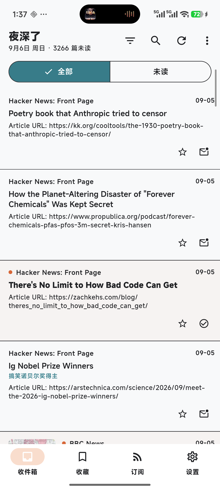
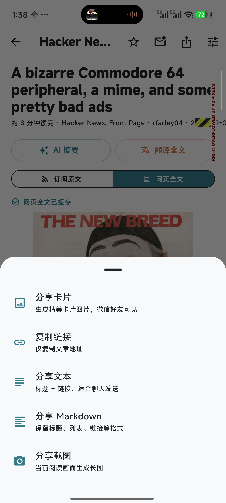

# Aurora Mobile

[](https://github.com/xiongsircool/aurora-rss-reader/actions/workflows/mobile-ci.yml)
[](https://github.com/xiongsircool/aurora-rss-reader/blob/main/LICENSE)
[](https://github.com/xiongsircool/aurora-rss-reader/releases/tag/mobile-v0.1.0)

**Aurora Mobile** 是 [Aurora RSS Reader](../../README_ZH.md) 的 Flutter 移动端，**本地优先**：无账号、无服务器，你的订阅与阅读数据全部只保存在设备上。支持 Android 与 iOS。

<p align="center">
  
  
  
  
</p>

## 📥 下载

前往 [Releases](https://github.com/xiongsircool/aurora-rss-reader/releases) 获取最新 APK：

| 文件 | 适用 |
|---|---|
| `Aurora-*-arm64.apk` | 2019 年后的绝大多数设备（推荐） |
| `Aurora-*-universal.apk` | 不确定设备架构时 |

iOS 版已完成真机验证，计划通过 TestFlight 分发。

## ✨ 功能

- **全格式解析** — RSS 1.0/2.0、Atom、Media RSS、播客；UTF-8/16、GBK、Big5、Shift-JIS 多编码
- **AI 能力**（自带 SiliconFlow/DeepSeek API Key）— 摘要生成、全文双语对照翻译、标题实时翻译（视口驱动，同语言自动跳过）
- **播客播放器** — 倍速（0.75–2.0x）、播放进度记忆、±15/30 秒跳转
- **视频卡片** — YouTube / Bilibili 链接自动渲染封面卡片
- **分享四件套 + 卡片** — 链接 / 标题文本 / Markdown 全文 / 屏幕截图 / 品牌分享卡片图
- **阅读体验** — 字号 / 行距 / 衬线字体调节、阅读时长估算、阅读进度记忆、代码块复制、图片保存相册
- **本地能力** — FTS5 全文搜索（5 万篇毫秒级）、OPML 导入导出、分组与静默、本地通知、WorkManager 后台刷新
- **细节** — 深色模式、实时搜索（防抖）、网络代理、提取失败原因提示

## 🏗️ 架构

```
lib/
├── app/            # 应用入口与主题
├── application/    # 用例层（刷新、提取、AI 生成）
├── data/           # Drift/SQLite 存储、HTTP 适配器、AI 客户端
├── domain/         # 纯 Dart 领域模型（Feed/Entry/解析/编码/翻译）
├── features/       # UI（inbox/reader/sources/settings/search）
├── platform/       # 通知、后台刷新、系统通道
└── shared/         # 跨功能工具（阅读统计、分享卡片渲染、图片查看）
```

- 存储使用 Drift (SQLite) + FTS5，schema 版本化管理并带迁移测试
- 网络、解析、持久化分离：刷新失败不会破坏本地快照
- 68 项单元/组件测试 + CI（analyze + test）+ tag 触发的发布流水线

## 🚀 开发

```bash
# 工具链：Flutter 3.47+ / JDK 17 / Android SDK 36
flutter pub get
flutter run            # 真机或模拟器
flutter test           # 68 项测试
flutter analyze
flutter build apk --release --split-per-abi
```

## 📄 许可

GPL-3.0 — 详见 [LICENSE](../LICENSE)。
